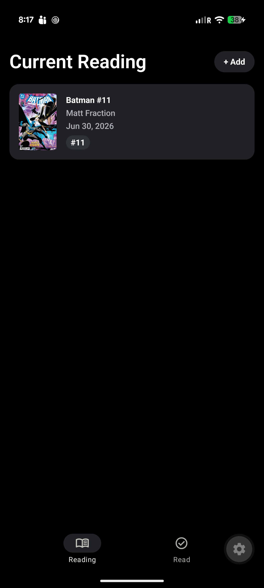
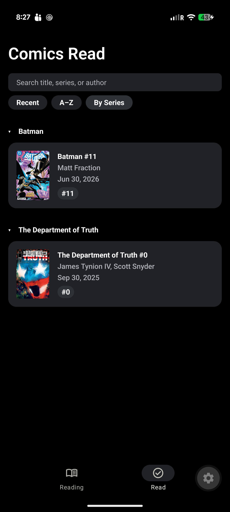
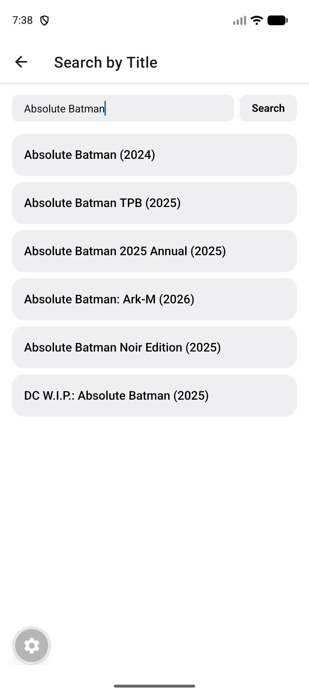
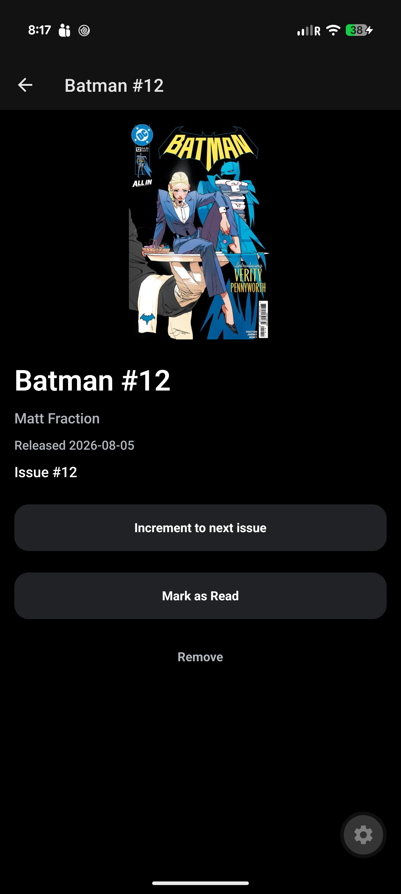

# Comic Track

A personal comic-reading tracker built with Expo/React Native. Scan or search for a comic, track what you're currently reading, increment to the next issue with real data pulled live from a comic database, and keep a browsable history of everything you've finished.

No pixel-art or terminal theming is shipped in the app yet — see [Design](#design) below for where that's headed.

## Screenshots

| Current Reading | Comics Read — By Series |
|---|---|
|  |  |

| Add → Confirm | Comic detail |
|---|---|
|  |  |

## Features

- **Current Reading**: active series/issues at a glance — cover, title, author, release date, issue number.
- **Add a comic** three ways:
  - **Scan barcode** — camera-based UPC (single issues) or ISBN (trade paperbacks) scan.
  - **Enter code manually** — type a UPC/ISBN directly, with a separate field for the small supplemental barcode single issues need for an exact match.
  - **Search by title** — text search against Metron's series database.
  - Every path lands on a **Confirm** screen before anything is saved.
- **Increment to next issue** — re-queries the API for the real next issue (new cover, release date, issue number) rather than just bumping a local counter, and automatically logs the issue you just finished into Comics Read.
- **Comics Read** — full history with search, and three sort modes: Recent, A–Z, and a collapsible **By Series** grouping.

## How it's built

- **Framework**: Expo + Expo Router (file-based routing), TypeScript.
- **Storage**: `expo-sqlite`, single `tracked_comics` table, thin repository module for all CRUD (`src/db/repository.ts`).
- **Comic data**: no single "comic API" fits every need, so this normalizes two sources behind one `ComicMatch` shape (`src/services/comics/`):
  - **[Metron](https://metron.cloud)** — series search, issue detail, and UPC-based barcode resolution for single issues.
  - **[OpenLibrary](https://openlibrary.org)** — ISBN lookup for trade paperbacks (no API key required).
  - `scripts/checkApis.ts` is a standalone sanity check for both integrations, independent of the app: `npm run check-apis`.
- **Camera**: `expo-camera`'s `CameraView`, targeting `ean13`/`ean8`/`upc_a`/`upc_e` symbologies.

## Design

The current app uses bare system styling. A proper visual identity — an "orange terminal" theme (real bundled monospace font, comic cards styled as a directory listing, section headers as shell prompts) — is being designed on the `design/terminal-theme` branch before any component code changes. Live interactive mockup, including an accent-color switcher (green/blue/red/yellow-orange/purple):

**[Longbox terminal theme concept →](https://claude.ai/code/artifact/a43fc1fb-2758-41b4-b4f2-854b7137c3da)**

## Getting started

```bash
npm install
cp .env.example .env   # fill in EXPO_PUBLIC_METRON_USERNAME / EXPO_PUBLIC_METRON_PASSWORD
npm run check-apis      # optional: verify Metron/OpenLibrary credentials before running the app
npx expo start
```

Requires a free [Metron](https://metron.cloud) account for `EXPO_PUBLIC_METRON_USERNAME`/`EXPO_PUBLIC_METRON_PASSWORD`. OpenLibrary needs no credentials.

Barcode scanning needs a physical device with a camera — Expo Go on iOS or Android both work; the simulator/emulator can exercise every other flow (search, manual entry, increment, read history).
