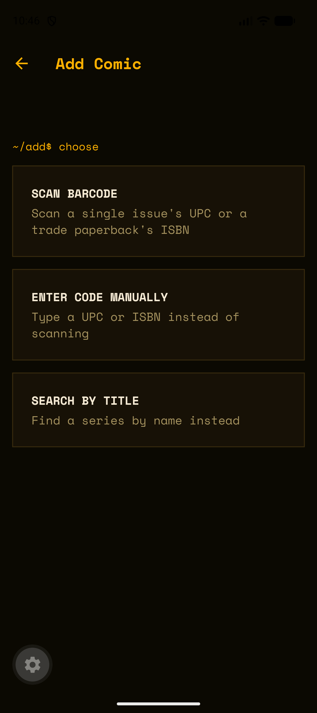

# Longbox

A personal comic-reading tracker built with Expo/React Native. Scan or search for a comic to file it in your backlog, pull it out when you start reading, and mark it as read when you're done — Longbox checks the real next issue for you and offers to add it, instead of a spreadsheet you forget to update. (Formerly named Comic Track.)

## Screenshots

| Current Reading | Comics Read — By Series |
|---|---|
|  |  |

| Add Comic | Comic detail |
|---|---|
|  |  |

## Features

- **Three states**: every comic is **Backlog**, **Reading**, or **Read**. Backlog is the default — owning a comic and having read it are different facts, so a comic you've bought but not opened has somewhere to live that isn't "currently reading."
- **Current Reading**: what you actually have in hand right now — cover, title, author, release date, issue number.
- **Comic Box**: the whole collection in one place, filterable by state (All / Backlog / Reading / Read), with search and three sort modes (Recent, A–Z, a collapsible **By Series** grouping).
- **Add a comic** three ways:
  - **Scan barcode** — camera-based UPC (single issues) or ISBN (trade paperbacks) scan.
  - **Enter code manually** — type a UPC/ISBN directly, with a separate field for the small supplemental barcode single issues need for an exact match.
  - **Search by title** — text search against Metron's series database.
  - Every path lands on a **Confirm** screen before anything is saved, and adds land in the Backlog.
- **Move between states** from any comic's detail screen: Start Reading, Mark as Read, Move to Backlog, Move back to Current Reading.
- **Mark as Read** — for single issues, checks the API for a real next issue first. If one exists, you're asked whether to add it to your backlog; either way the current issue moves to Read. No next issue yet (or a TPB, which has no "next issue" concept) just marks it read directly.
- **Check for Next Issue** — on every read single issue, so you can catch a new release without re-scanning or re-searching.

## How it's built

- **Framework**: Expo + Expo Router (file-based routing), TypeScript.
- **Storage**: `expo-sqlite`, single `tracked_comics` table, thin repository module for all CRUD (`src/db/repository.ts`).
- **Comic data**: no single "comic API" fits every need, so this normalizes three sources behind one `ComicMatch` shape (`src/services/comics/`):
  - **[Metron](https://metron.cloud)** — series search, issue detail, and UPC-based barcode resolution for single issues.
  - **[OpenLibrary](https://openlibrary.org)** — ISBN lookup for trade paperbacks (no API key required).
  - **[Google Books](https://developers.google.com/books)** — fallback ISBN lookup, only tried when OpenLibrary doesn't have a given ISBN. Works unauthenticated (lower quota); an API key is optional.
  - `scripts/checkApis.ts` is a standalone sanity check for all three integrations, independent of the app: `npm run check-apis`.
- **Camera**: `expo-camera`'s `CameraView`, targeting `ean13`/`ean8`/`upc_a`/`upc_e` symbologies.

## Design

Longbox uses an "orange terminal" theme: a bundled monospace font (Space Mono), a single dark palette with a `#FCB001` accent, square corners, hairline borders, no shadows/gradients. Comic cards read like a directory listing; section headers read like a shell prompt. This is shipped in the app now — see the screenshots above.

The app icon is the same `~/L` mark the landing page uses (`docs/assets/longbox-mark.svg`), rendered in Space Mono Bold. `assets/images/icon.png` is the full square lockup with its bezel; the Android adaptive icon splits into a transparent `android-icon-foreground.png` — glyph only, sized to the center-66% safe zone, since launchers crop and mask the edges — over an `adaptiveIcon.backgroundColor` of `#0B0902`, plus a white-on-transparent monochrome variant for themed icons.

The original interactive design exploration — including the accent-color switcher (green/blue/red/yellow-orange/purple) used to land on this direction — is preserved here:

**[Longbox terminal theme concept →](https://claude.ai/code/artifact/a43fc1fb-2758-41b4-b4f2-854b7137c3da)**

## Getting started

```bash
npm install
cp .env.example .env   # fill in EXPO_PUBLIC_METRON_USERNAME / EXPO_PUBLIC_METRON_PASSWORD
npm run check-apis      # optional: verify Metron/OpenLibrary/Google Books before running the app
npx expo start
```

Requires a free [Metron](https://metron.cloud) account for `EXPO_PUBLIC_METRON_USERNAME`/`EXPO_PUBLIC_METRON_PASSWORD`. OpenLibrary needs no credentials. `EXPO_PUBLIC_GOOGLE_BOOKS_API_KEY` is optional — only raises the fallback's rate limit, the app works without it.

Barcode scanning needs a physical device with a camera — Expo Go on iOS or Android both work; the simulator/emulator can exercise every other flow (search, manual entry, mark as read, read history).

## Building

```bash
eas build --profile preview --platform android   # installable APK
```

`.env` covers local development only. It's gitignored, and EAS cloud builds upload just the git-tracked files, so a build that relied on it would bundle empty credentials and fail at the first Metron call with `MissingCredentialsError`. The credentials live as [EAS environment variables](https://docs.expo.dev/eas/environment-variables/) instead, and each build profile in `eas.json` names the environment it pulls from (`preview` → `preview`, `production` → `production`).

To set them up on a fresh project, or after rotating a credential:

```bash
eas env:set --name EXPO_PUBLIC_METRON_USERNAME --value '<username>' \
  --visibility sensitive --environment preview --environment production
# repeat for EXPO_PUBLIC_METRON_PASSWORD and (optionally) EXPO_PUBLIC_GOOGLE_BOOKS_API_KEY
eas env:list --environment preview   # verify before building
```

Note that `EXPO_PUBLIC_*` values are inlined into the JS bundle as plain strings at build time, so anyone holding the APK can read the Metron password out of it. That's acceptable for personal builds; don't distribute the artifact.
